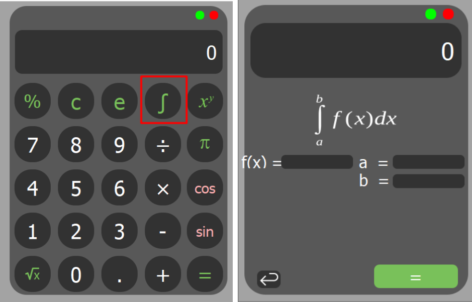

# Calculadora

Este é um aplicativo que funciona como uma calculadora comum e também pode calcular integrais. Para usar a calculadora, basta digitar as expressões matemáticas diretamente na caixa de entrada e pressionar o botão "calcular".

  

## Como usar a calculadora?

A calculadora funciona com as operações matemáticas padrão, como adição (+), subtração (-), multiplicação (*), divisão (/) e exponenciação (**). Para realizar uma multiplicação, é necessário o uso do asterisco: 2*x.

### Integrais

Para calcular integrais, algumas regras devem ser seguidas:

- Notações:
  - Expoente: “**”
  - Multiplicação: “*” - quando for realizar alguma multiplicação, não basta escrever, por exemplo 2x, é necessário o uso do asterisco: 2*x
  - Divisão: “/”
  - π: “pi”
  - Euler: “e”
  - Logaritmo natural: “ln2” (2 pode ser substituído por outros números)
  - Usar somente a notação f(x)
- Ao fornecer a f(x):
  - Omitir o dx
  - Calcula apenas a integral de senx e cosx, não computando, por exemplo cos2x, sen3x
  - Dentro das relações trigonométricas, computa apenas sen e cos

## Sobre o projeto

Este projeto foi criado como parte de um desafio para aprimorar as habilidades de programação em Python . É um projeto de código aberto, licenciado sob a Licença MIT.

